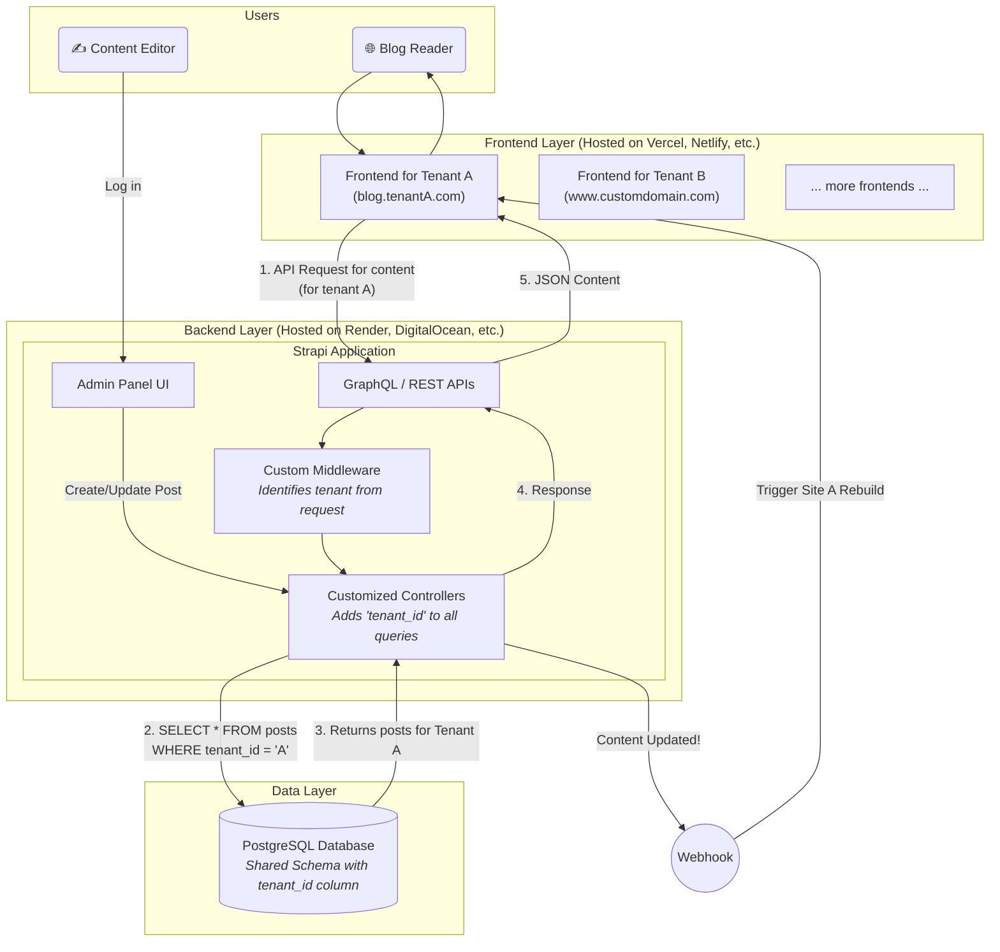

# Strapi Multi-Tenant Architecture

This diagram illustrates a multi-tenant blog architecture using Strapi as a headless CMS.

### Diagram Breakdown

1.  **Users:**
    *   **Blog Reader:** The end-user visiting one of the frontend blog sites.
    *   **Content Editor:** A user from a specific tenant who logs into the central Strapi backend to write and manage their blog posts.

2.  **Frontend Layer:**
    *   These are your "many frontends." They are completely independent applications (e.g., built with Next.js, Astro, etc.).
    *   Each site is mapped to a tenant. The system identifies the tenant based on the domain/subdomain of the request (e.g., `blog.tenantA.com` maps to tenant 'A').
    *   They are "headless" — their only job is to fetch data from the Strapi API and render it.

3.  **Backend Layer (Strapi):**
    *   This is your single, centralized CMS.
    *   The **Admin Panel** is the UI where editors log in.
    *   A request from a frontend hits the **APIs**.
    *   The **Tenant Middleware** is the crucial first custom component. It inspects the request (e.g., the `Host` header) to figure out which tenant's data is being requested. It attaches the `tenant_id` to the request context.
    *   The **Customized Controllers** are modified versions of Strapi's default controllers. Before executing any database operation (like `find` or `findOne`), they add a `WHERE` clause to filter by the `tenant_id` from the middleware. **This is the step that guarantees data isolation.**

4.  **Data Layer:**
    *   A single **PostgreSQL Database**.
    *   All tables (`posts`, `users`, `tags`, etc.) have a `tenant_id` column. This is the "Shared Database, Shared Schema" model we discussed.

5.  **The Webhook Flow (Automation):**
    *   When an editor publishes or updates a post, Strapi can be configured to send a **webhook** to the corresponding frontend's hosting provider (e.g., Vercel).
    *   This webhook tells the provider to automatically rebuild and deploy the static site, ensuring new content goes live immediately. This is a critical piece for automating the platform.
